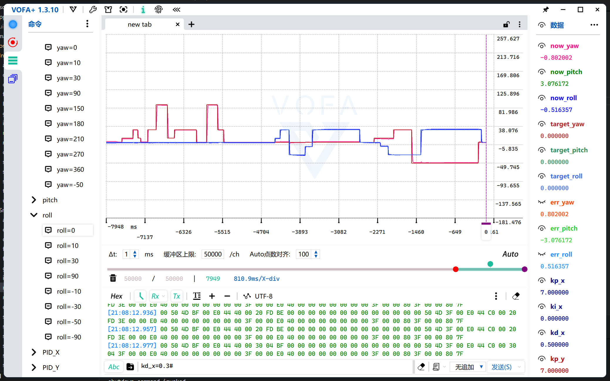

# 					云台控制


硬件：
达妙DM-J4310-2EC电机，达妙H7开发板，JY61P模块

功能：最终要实现云台自稳定

## 项目使用

使用vscode中编写，使用CMake生成构建系统，ninja生成构建项目
前提是需要安装 `CMake`、`ARM GCC 工具链`、`Ninja`等工具

```powershell
# 1. 回到根目录
cd E:\Github_warehouse\JumpCat_Gimbal\FreeRTOS_Project

# 2. 清理旧的 build
Remove-Item build -Recurse -Force -ErrorAction SilentlyContinue

# 3. 用 Debug 预设配置
cmake --preset Debug

# 4. 注意！进入正确的目录：build/Debug
cd build/Debug

# 5. 编译
ninja


# 或者一键编译烧录(快捷键)
Crtl + Shift + B
```


## 项目简介介绍

```tex
FreeRTOS_Project/
├── App/                           # 应用层入口
├── Core/                          # STM32 HAL 底层驱动
│   ├── Inc/                       # 头文件
│   └── Src/                       # 源文件（main.c, freertos.c, stm32h7xx_hal_msp.c等）
├── Drivers/                       # STM32 官方驱动库
│   ├── CMSIS/                     # ARM Cortex-M 内核抽象层
│   └── STM32H7xx_HAL_Driver/      # STM32H7 HAL 库
├── Middlewares/                   # 第三方中间件
│   ├── ST/                        # ST官方中间件
│   │   ├── ARM/DSP/               # ARM DSP 数学库
│   │   └── STM32_USB_Device_Library/  # USB 设备库
│   └── Third_Party/FreeRTOS/      # FreeRTOS 实时操作系统
├── USB_DEVICE/                    # USB 设备配置
├── User_Config/                   # 用户配置文件（预留）
├── User_File/                     # 用户代码（核心业务逻辑）
│   ├── 1_Middleware/              # 中间件层
│   │   ├── Algorithm/             # 算法库
│   │   │   ├── Basic/             # 基础数学运算
│   │   │   ├── Complex/           # 复数运算
│   │   │   ├── Filter/            # 滤波器
│   │   │   │   ├── EKF/           # 扩展卡尔曼滤波
│   │   │   │   ├── Frequency/     # 频率滤波
│   │   │   │   └── Kalman/        # 卡尔曼滤波
│   │   │   ├── FSM/               # 有限状态机
│   │   │   ├── Matrix/            # 矩阵运算
│   │   │   ├── PID/               # PID 控制器（alg_pid.h/cpp）
│   │   │   ├── Quaternion/        # 四元数运算
│   │   │   ├── Queue/             # 队列算法
│   │   │   └── Slope/             # 斜率计算
│   │   ├── Driver/                # 硬件驱动抽象层
│   │   │   ├── ADC/               # ADC 驱动
│   │   │   ├── CAN/               # CAN 总线驱动（drv_can.cpp）
│   │   │   ├── OSPI/              # OSPI 闪存驱动
│   │   │   ├── SPI/               # SPI 驱动
│   │   │   ├── UART/              # 串口驱动（drv_uart.cpp）
│   │   │   ├── USB/               # USB 驱动
│   │   │   └── WDG/               # 看门狗驱动
│   │   └── System/                # 系统服务
│   │       └── Timestamp/         # 时间戳服务
│   ├── 2_Device/                  # 设备驱动层
│   │   ├── BSP/                   # 板级支持包
│   │   │   ├── BMI088/            # BMI088 六轴传感器
│   │   │   │   ├── Accel/         # 加速度计驱动
│   │   │   │   └── Gyro/          # 陀螺仪驱动
│   │   │   ├── Buzzer/            # 蜂鸣器驱动
│   │   │   ├── Control/           # 遥控器接收机（bsp_control.cpp）
│   │   │   ├── JY61P/             # JY61P IMU 模块（bsp_jy61p.cpp）
│   │   │   ├── Key/               # 按键驱动
│   │   │   ├── Power/             # 电源管理
│   │   │   ├── W25Q64JV/          # 外部 Flash 驱动
│   │   │   └── WS2812/            # WS2812 RGB LED 驱动
│   │   ├── Motor/                 # 电机驱动
│   │   │   ├── Motor_DJI/         # 大疆电机驱动
│   │   │   └── Motor_DM/          # 达妙电机驱动（dvc_motor_dm.cpp）
│   │   ├── Plotter/               # 数据可视化
│   │   │   ├── Serialplot/        # SerialPlot 上位机协议
│   │   │   └── Vofa/              # VOFA+ 上位机协议（dvc_vofa.cpp）
│   │   └── Powermeter/            # 功率计驱动
│   └── 4_Task/                    # FreeRTOS 任务层
│       ├── Control/               # 轴控制类（axis_control.h/cpp）
│       ├── control_task.cpp/h     # 遥控器数据解析任务
│       ├── jy61p_task.cpp/h       # JY61P IMU 读取任务
│       ├── motor_dm_task.cpp/h    # 达妙电机控制任务
│       ├── rc_angle_speed_task.cpp/h  # 遥控器角度/速度控制任务
│       ├── set_angle_test_task.cpp/h # VOFA 角度控制测试任务（已注释）
│       ├── vofa_task.cpp/h        # VOFA 上位机通信任务（已注释）
│       └── ws2812_task.cpp/h      # RGB LED 控制任务
├── CMakeLists.txt                 # CMake 构建配置
├── H7_test.ioc                    # STM32CubeMX 配置文件
├── STM32H723XG_FLASH.ld           # 链接脚本
└── startup_stm32h723xx.s          # 启动文件
```

## 具体改动

```tex
4_Task/
├── control_task.cpp/h        # 遥控器数据解析（旋钮→角度，摇杆→速度）
├── rc_angle_speed_task.cpp/h # 角度闭环/速度闭环控制
├── jy61p_task.cpp/h          # JY61P IMU数据读取
├── motor_dm_task.cpp/h       # 达妙电机MIT模式控制
└── Control/                  # 轴控制类（核心算法）
    ├── axis_control.cpp      # PID控制、角度环、速度环,封装成了轴的Class类
    └── axis_control.h        # 线程安全的轴控制类
```


## 云台思路

**角度闭环控制**

```tex
VOFA发送 yaw=90°/遥控器旋钮转动得到的目标角度
      ↓
set_angle_test_task 接收目标角度
      ↓
读取 JY61P 当前角度 (如当前30°)
      ↓
计算角度误差 = 90° - 30° = 60°
      ↓
PID控制器: 误差60° → 目标速度 (rad/s)
      ↓
motor_dm_task: MIT模式控制电机转动
      ↓
云台转动，JY61P实时反馈
      ↓
角度误差逐渐减小 → 速度逐渐降低
      ↓
到达90° → 误差为0 → 停止

```

**角速度闭环控制**

```tex
遥控器摇杆 
      ↓
目标角速度 = 摇杆值 × 最大角速度 (如 90°/s)
      ↓
读取 JY61P 当前角速度 (如 10°/s)
      ↓
计算速度误差 = 90°/s - 10°/s = 80°/s
      ↓
PID控制器 (速度环): 误差 → 目标力矩/电流 (或直接速度)
      ↓
电机驱动 (MIT模式: 使用 KD 或 速度环输出)
      ↓
云台加速转动，JY61P实时反馈角速度
      ↓
速度误差逐渐减小 → 输出逐渐降低
      ↓
达到目标速度 → 误差为0 → 输出稳定
```


| `yaw=数值#`       |            **例如 `yaw=90#` 让云台转到90度方向**             | **设定目标偏航角** |      |
| ----------------- | :----------------------------------------------------------: | ------------------ | ---- |
| **`pitch=数值#`** |             **例如 `pitch=30#` 让云台上仰30度**              | **设定目标俯仰角** |      |
| **`roll=数值#`**  |              **例如 `roll=15#` 让云台侧倾15度**              | **设定目标横滚角** |      |
| **`kp_x=数值#`**  | **例如 `kp_x=1.0#` 让 `水平 `电机角度误差转换成目标速度的kp参数设为1.0** | **设定kp值**       |      |
| **`kp_y=数值#`**  | **例如 `kp_y=2.8#` 让 `竖直 `电机角度误差转换成目标速度的kp参数设为2.8** | **设定kp值**       |      |
| **`kd_x=数值#`**  | **例如 `kd_x=3.5#` 让 `水平 `电机角度误差转换成目标速度的kd参数设为3.5** | **设定kd值**       |      |
| **`kd_y=数值#`**  | **例如 `kd_y=2.5#` 让 `竖直 `电机角度误差转换成目标速度的kd参数设为2.5** | **设定kd值**       |      |
| **`en=0.0#`**     | **例如 `en=0.0#` 让竖直和水平电机失能呢个，不使用VOFA调参**  | **设定kd值**       |      |

如果使用VOFA调参需要先将`en`设置为`大于0`的数，例如**`en=1.0#`**

现在就可以使用**VOFA在线调节参数**，不需要手动一遍一遍的修改再烧录了

## VOFA上位机效果

**下图可以看到`目标角度`和`当前角度`跟踪的还是挺不错的**



### 注意

该工程中需要确认这个`JY61P`的**安装方向**，这里使用的**roll角**来确定的俯仰

这里贴出 *目前使用*  的 JY61P 的 *正方向*

**

**运动示意图：**


## 遥控器上的效果

模式选择的开关，拨到**最上面**是`失能`，不使用遥控器控制
			     拨到**中间**是选择`设置目标角度`
			     拨到**最下面**是选择`设置目标角速度`（类似于穿越机的摇杆控制）


<video 
  src="./.assets/RC_Control.mp4" 
  controls 
  width="80%" 
  poster="./.assets/RC_Control_pic.jpg"
></video>
